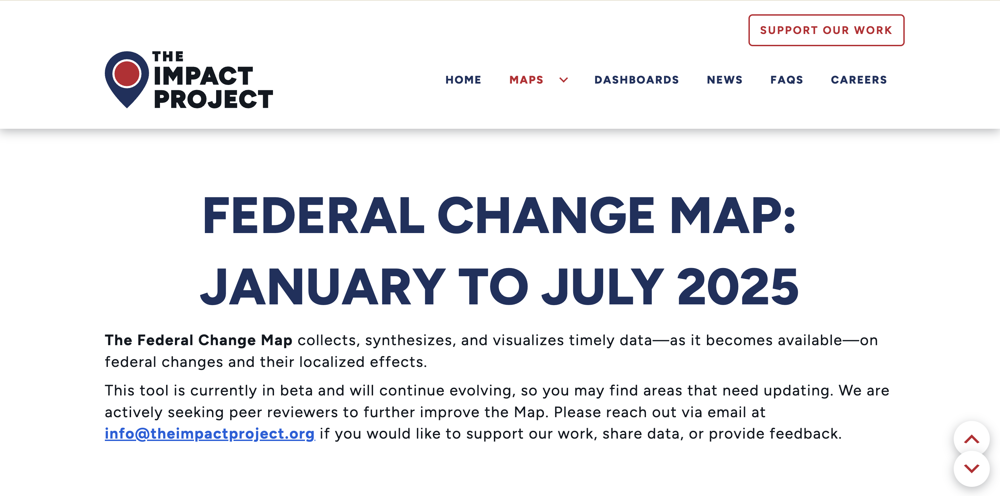

# Data Visualization Portfolio

**Khushi Desai** · Data Visualization & Data Science
[LinkedIn](https://www.linkedin.com/in/khushi-desai-39b3511b7) · [GitHub](https://github.com/khushineedssleep) · khushi@uchicago.edu

**Jump to:** [Projects](#featured-projects) · [Data Visualization Workshops](#data-visualization-workshops) · [Teaching Assistant](#teaching-assistant) · [Skills](#skills)

> **Every project linked below is live.** Click a static image (or the link under it) to open the **live, interactive version** of the visualization.

---

## About Me

I am a Computer Science and Public Policy major, data scientist and data visualization analyst with hands-on experience in analyzing large-scale healthcare and education data, deploying Python and R data pipelines, and applying statistical modeling, and machine learning to make policy and business decisions. I hold an [MS in Computational Analysis and Public Policy](https://capp.uchicago.edu/) from The University of Chicago, where I was one of three inaugural [Data Visualization Fellows](https://www.lib.uchicago.edu/research/scholar/phd/2025-data-visualization-fellows/) at the Centre for Digital Scholarship (UChicago Library). I am fluent with Python, R and SQL, validating data quality, and translating analysis into insight for cross-functional stakeholders.

Most of my work sits at the intersection of healthcare, public policy and computational approaches to problem-solving. At the [Centre for Climae, Health and Society](https://crownschool.uchicago.edu/chas), I with claims-level Medicaid data (T-MSIS), county-level federal health funding, and previously I worked 130 years of university dissertation archival data, and 25 years of [InfoGroup Business data](https://www.lib.uchicago.edu/restricted/db/infogroup-historical-datafile/). In every case the job is the same: clean and model the data so it's trustworthy, then design a visual that an administrator, a stakeholder, a researcher or anyone can understand without reading the methods section first.

I'm also an artist, and I teach. I've run data visualization workshops for undergraduates, graduate students, post-docs and faculty, and I've been a teaching assistant for programming courses in R and Python. Both habits push me toward visuals that are accessible, well documented and easy for someone else to pick up.

---

## Featured Projects

### 1. The Impact Map: Tracking Federal Health Funding and Workforce Cuts

**Tools:** Python, web scraping, LLM-based extraction (prompt-engineered JSON output), ETL
**My role:** Built the data pipeline that keeps the map current

🔗 **[Open the interactive Impact Map →](INTERACTIVE_LINK_IMPACT_MAP)** *(clicking the image or this link takes you to the interactive version)*

The Impact Map is a national, county-level map of how federal policy changes reach local communities. The health layer joins **HHS grants and contracts (total and per capita), SAMHSA grants, Medicaid enrollment, county Medicaid coverage rates, HHS employees and HHS sites**, with point layers for mental health, public health, healthcare and federal facilities. Overlays for rural counties, Indigenous lands, majority non-white areas and poverty areas let users see who is most exposed.

*The federal workforce layer: total and probationary federal workers by state, county and congressional district, filterable by sector.*

**What I built:** An ETL pipeline that scrapes news coverage and uses an LLM with carefully engineered prompts to pull structured JSON (funding amounts, locations and affected populations) out of **16,000+ unstructured news articles**. The extracted records are validated and loaded into the map's data layer, so the map stays up to date as policy changes happen instead of relying on manual entry.

---

### 2. UChicago Dissertations Explorer (1893–2025)

**Tools:** Python (pandas, spaCy NER, scikit-learn TF-IDF), network analysis, geospatial analysis, interactive web visualization
**Team:** Data Visualization Fellowship 2025–26, with Jasmine Lu and Andrew McGallian

🔗 **[Open the interactive Dissertations Explorer →](INTERACTIVE_LINK_DISSERTATIONS)** *(clicking the image or this link takes you to the interactive version)*

An interactive portrait of **32,013 PhD dissertations across 132 years** at the University of Chicago. The platform asks three questions: how have dissertation topics and departments changed over time, where in the world have UChicago scholars focused their research, and what do advisor and committee networks reveal about academic lineage?

**The data work behind it**
- **Three messy sources, one dataset.** ProQuest only records departments after 2009, so we filled the gap with **22,993 records hand-compiled from 77 years of convocation programs** (1932–2009) and OCR-parsed HathiTrust catalogs (1893–1931).
- **300+ raw department names → 44 canonical departments**, through explicit, documented lookup tables. Records that can't be placed reliably are marked UNKNOWN instead of being forced into the wrong category.
- **Record matching** on title + year, with prefix and surname fallbacks; only unambiguous matches are accepted.
- **96.9% department and building coverage**, from a fully deterministic, reproducible pipeline. The cleaned 15-column CSV ships with a README, license and citation guidance.

**Views**

*Keyword Similarity Ring: all 44 departments in campus order, with chords weighted by TF-IDF cosine similarity. Hover a node to see its strongest connections.*

*Force-directed similarity network colored by academic division. Humanities departments cluster tightly; the sciences sit apart.*

*Network Analysis: divisions, departments and their cross-disciplinary links. Click a division to see its departments and dissertation counts.*

*Dissertation Explorer: search any keyword and see when it first appears. "Feminism" shows up in 1974 and accelerates after 2000.*

Other views include a **campus choropleth** (buildings colored by dissertation count, with a year slider and animated playback), a **global research map** built with spaCy NER and a 200+ entry place-name normalization table, and **department history timelines** with cited building histories.

---

### 3. American Fringe Economy Atlas (1997–2022)

**Tools:** R, Python, ggplot2, Plotly, ArcGIS, geospatial analysis
**Context:** Data Visualization Fellowship, Centre for Digital Scholarship · Political Economy and Race Lab (PEARL)

🔗 **[Open the Interactive ZIP Atlas →](INTERACTIVE_LINK_FRINGE_ZIP_ATLAS)** · **[Open the National Service Maps →](INTERACTIVE_LINK_FRINGE_NATIONAL_MAPS)** *(each link takes you to the interactive version)*

America's fringe economy (payday lenders, check cashers, title lenders and pawn shops) is a $78 billion industry, and it is not spread evenly. This atlas maps how alternative financial services have grown, shrunk and moved across American cities since the late 1990s. It joins historical business establishment records with ZIP-level demographic data to study how financial infrastructure lines up with race, income and urban inequality.

**What the data shows**
- Fringe financial services expanded quickly through the early 2000s and **peaked around 2007**, then fell sharply after the financial crisis before leveling off.
- Banks and credit unions grew steadily until the mid-2010s, narrowing the gap with fringe services, then declined again. The national trend hides big local differences, which is what the ZIP-level atlas is for.
- At the ZIP level, the atlas lets users see which neighborhoods are served by banks and which are served by check cashers.

<b>Static research maps from this project (click to expand)</b>

*Fringe economy services per 10,000 residents by state (2016). Mississippi has the highest concentration, at 11.06 per 10,000 residents.*

*Fringe economy service use by race. Black Americans report the highest use across every service type, with nearly 50% using check cashing and pawn shops.*

*Bivariate choropleth of income, race and check-cashing services in Chicago.*

*Payday lending regulation, 2016 vs. 2020: permissive states fell from 26 to 22, and 6 states moved to more restrictive policies.*

*Black-and-white versions of the maps are available for colorblind readers.*

---

## Data Visualization Workshops

I designed and taught a **Data Visualization Workshop Series** for the Centre for Digital Scholarship at the University of Chicago Library (Regenstein Library). The workshops are beginner-friendly and open to undergraduates, graduate students, post-docs and faculty in any discipline; no prior programming experience is required. Each one pairs a short concept talk with a live-coding notebook, and every workshop's code, data and slides are open source, so anyone can work through it on their own.

### 1. Literary Data Art with R and ggplot2
**November 7, 2025** · Centre for Digital Scholarship, Regenstein Library
**Tools:** R, RStudio, ggplot2, dplyr, stringr
📂 **[Workshop materials on GitHub →](https://github.com/khushineedssleep/Data-Art-Workshop)**

*A passage from a novel turned into a color grid: each letter maps to its own color, so the patterns in the text become visible.*

An introduction to ggplot2 through art. Participants turn literary passages into color-coded grid visualizations and, along the way, learn the core ideas that carry over to any chart:
- **The grammar of graphics**: data, aesthetics, geoms and layers
- **Turning text into data**: tokenizing and reshaping strings with stringr and dplyr
- **Color mapping**: how color choices reveal (or hide) patterns
- **Customizing and exporting**: themes, scales and print-ready output

---

### 2. Introduction to ggmap: Visualizing Spatial Data
**February 3, 2026** · Centre for Digital Scholarship, Regenstein Library
**Tools:** R, RStudio, ggplot2, ggmap, tidyverse
📂 **[Workshop materials on GitHub →](https://github.com/khushineedssleep/spatial-data-R-ggmap)**

*John Snow's 1854 map of the Broad Street cholera outbreak, the case study the workshop is built around.*

The workshop starts with one of the most famous maps in public health: John Snow's 1854 Broad Street cholera map, which traced an outbreak to a single water pump. From there, participants learn to:
- Pull basemaps and layer point data on them with **ggmap** and **ggplot2**
- Work with real Chicago datasets (**311 service requests** and **crime reports**)
- Use density and point layers to find spatial patterns, the same way Snow did

---

### 3. Animating Data with gganimate
**[DATE]** · Centre for Digital Scholarship, Regenstein Library
**Tools:** R, ggplot2, gganimate
🎥 **[Watch the workshop recording →](GGANIMATE_VIDEO_LINK)** · 📂 **[Workshop materials →](GGANIMATE_REPO_LINK)**

*Click the slide to watch the recording.*

When should a chart move, and how do you make it move well? This workshop introduces the **grammar of animation** in gganimate:
- **Transitions** (`transition_*()`): how data changes from frame to frame (states, time, reveal, layers, filter and more)
- **Views** (`view_*()`): how axes and scales follow the data
- **Shadows** (`shadow_*()`): how past frames stay on screen (`shadow_mark`, `shadow_trail`, `shadow_wake`)
- **Entrances and exits** (`enter_*()` / `exit_*()`): how new data appears and old data leaves (fade, grow, fly, drift, recolor)
- **Animation options**: controlling `nframes`, `fps` and `duration` with `animate()`

We close with design guidance on **pace, perplexity and purpose**: animation should add information a static chart can't show, not just motion.

---

## Teaching Assistant
*The University of Chicago*

- **Functional R Programming**: supported students learning to write clean, reproducible R code through office hours, debugging help and assignment feedback.
- **Data and Programming for Public Policy (Python)**: supported public policy students learning Python for data analysis and visualization through office hours, debugging help and grading.

---

## Skills

**Visualization & BI:** Tableau, Power BI, ggplot2, gganimate, ggmap, Plotly, Matplotlib, Seaborn, Folium, ArcGIS
**Data & Engineering:** SQL, PostgreSQL, relational data modeling, ETL pipelines, REST APIs, Docker, Git/GitHub
**Languages:** Python, R, SQL, JavaScript
**Analysis:** pandas, NumPy, scikit-learn, spaCy (NLP), network analysis, geospatial analysis, regression modeling (OLS, GLM, Poisson)
**Data domains:** Medicaid claims (T-MSIS), federal health funding (HHS, SAMHSA), survey data (CMPS, ACS), archival and text data

---

## More Work: Gateway House (Mumbai)

As a data analyst at [Gateway House: Indian Council on Global Relations](https://www.gatewayhouse.in/), I designed published maps and infographics on global politics and development.

*54 democratic elections scheduled worldwide in 2024, with South Asian countries highlighted.*

*U.S. sanctions worldwide, 1807–2025, by type (trade, arms, travel, financial and more).*

*Least developed countries by region.*

*Disability rights advocacy partnerships across India.*
